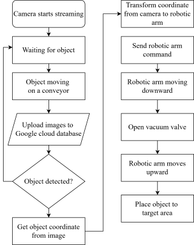
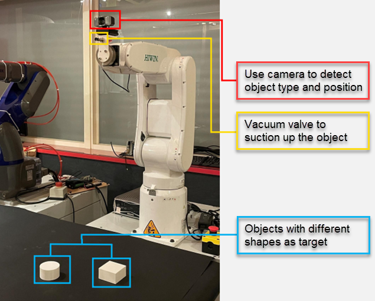

5G_RobotArm_Remote_Control
===
## Table of Contents

[TOC]

## Background
Thanks to the development of 5-generation network, we are able to implement cloud computation in time-demanding computation or artifical intelligent without using high-end edge-computation device. In future, the manufacturing line can use  low-computing power devices as edge devices and computing on the cloud server to lower the computation cost.

The comparison of 4G/5G network will be shown in below.

## Objective Goal
In this demo, we're going to use Raspberry Pi (for easily obtaine, you may use any other embedded device like ESP32 or ESP8266) and a 5G Wi-Fi hotspot device to transmit image which taken by a camera installed on the end-effector of a robitc arm. The cloud computating server will analysis the image and determine the best position of the end-effector to grap the object and send the command via 5G network to the robotic arm.
## Flowchart

## Implementation

## Comparison

4G Network
| Times   | Open Camera | Upload Image | Download Coord | Download Image    | Recognition |  Upload Coord   |
| ------- | ----------- | ------------ | -------------- | ----------------  | ----------- | --------------- |
| 1       | 0.5683      | 0.5715       | 0.5799         | 0.8852            | 0.1005      |  0.2165         |
| 2       | 0.5599      | 0.6688       | 0.6612         | 1.2284            | 0.1105      |  0.2104         |
| 3       | 0.5718      | 0.7610       | 0.6246         | 0.9267            | 0.1022      |  0.2109         |
| 4       | 0.5565      | 0.5729       | 0.6518         | 1.5856            | 0.1001      |  0.2093         |
| 5       | 0.6658      | 0.5618       | 0.6702         | 1.5855            | 0.1322      |  0.2146         |
| 6       | 0.5712      | 0.5881       | 0.6065         | 1.2155            | 0.1014      |  0.2135         |
| Average | 0.5822      | 0.6207       | 0.6324         | 1.2378            | 0.1078      |  0.2125         |

5G Network
| Times   |  Open Camera    | Upload Image | Download Coord | Download Image    | Recognition | Upload Coord    |
| ------- | --------------- | ------------ | -------------- | ----------------- | ----------- | --------------- |
| 1       | 0.5697          | 0.5203       | 0.4859         | 1.0933            | 0.1062      | 0.2297          |
| 2       | 0.5619          | 0.2769       | 0.5368         | 0.8985            | 0.1035      | 0.2068          |
| 3       | 0.5726          | 0.2985       | 0.5122         | 0.9702            | 0.1187      | 0.2183          |
| 4       | 0.5712          | 0.3416       | 0.4883         | 1.5856            | 0.1070      | 0.2086          |
| 5       | 0.5752          | 0.5083       | 0.5046         | 1.5851            | 0.1051      | 0.2165          |
| 6       | 0.5699          | 0.5517       | 0.4914         | 0.9774            | 0.1050      | 0.2160          |
| Average | 0.5701          | 0.4162       | 0.5032         | 1.0704             | 0.1076     | 0.2160       |

Comparison
|                | 4G Network | 5G Network | Improvement (%) |
| -------------- | --------  | --------    | --------        |
| Open Camera    | 0.5822   | 0.5701       | 2.12%           |
| Upload Image   | 0.6207   | 0.4162       | 49.13%          |
| Download Coord | 0.6324   | 0.5032       | 25.67%          |
| Download Image | 1.2378   | 1.0704       | 15.64           |
| Recognition    | 0.1078   | 0.1076       | 0.18            |
| Upload Coord   | 0.2125   | 0.216        | 1.62            |
